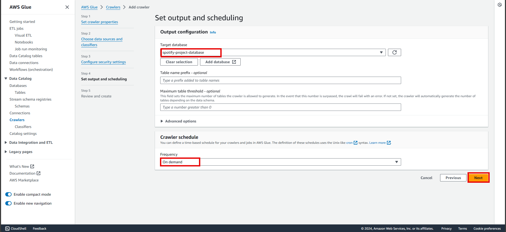

# Big Data Analytics Pipeline Using Modern Data Architecture

The objective of this project is to build a data pipeline and present it in a proper format through a visualization dashbaord. In real world the data might be coming from different and multiple data sources. From there it gets picked up by AWS Glue and perform certain transformations as required and load it to a target destination. So, in this case we are using a public dataset which is available on kaggle as raw data, but for the sake of ease I have done some initial cleaning and generated three csv files which I am going to use as my raw data. So, Glue will extract those data and perform few transformations and load it to a data lake. From there we will perform our analysis using Amazon Athena and visualization using Amazon QuickSight.

## Application architecture

*Dataset used in this project is taken from kaggle, here is the link: [Spotify Dataset](https://www.kaggle.com/datasets/tonygordonjr/spotify-dataset-2023)*

## Part 1: Creating S3 bucket for staging and data lake

In this part, we will be creating an S3 bucket which will hold our raw data and as well as our data lake into two different folders within the bucket.

1. Go to the **S3 console** and choose **Create bucket**.
2. Under **general configuration**, select a **Region** under the **AWS Region** dropdown menu. Though S3 is a global service, but it is needed to put a region. So, it is preferred to select a region which is nearer.
3. Give a **Bucket name**, which must be globally unique.
4. Keep rest of everything as defaults and Choose **Create bucket**.

5. Now go inside the bucket and choose **Create folder**.

6. Here create two different folders by putting the names as **"staging"** and **"datalake"**.

7. Go inside the **staging** folder, choose **Upload**. Select all those three csv files from **data/processed-data** and upload.

## Part 2: Create a data-pipeline using AWS Glue

In this part we will create an ETL pipeline between the staging and datalake with the help of AWS Glue service.

1. Go to the **AWS Glue console**. Navigate to the **Visual ETL** from left pane.

2. Here we have to create our pipeline with this new UI by the help of **Sources, Transforms and Targets** options.

3. The final pipeline should look like below, where basically we are taking those individual csv files from the **S3 data source (staging)** and applying **transformations as Join and DropFields for dupicates** then loading the final data to destination **S3 data target (datalake)** as parquet format.

4. Change the tab to **Job details**. Give a **Name** for this ETL job, select an **IAM role** and select the **Language** as **Python 3** from the dropdown.

5. Select the **Requested number of workers** as preference or required.
6. Keep rest of everything as defaults and **Save**.

7. Select the Job, choose **Run**.

Now for validation, as a result the job should produce some files in parquet into the S3 datalake. So naviagte to the **S3 bucket** and open the **datalake folder**.

## Part 3: Create a Glue Crawler

In this part, we will be creating a Glue Crawler. It will crawl through our data and learn/generate the schema out of it on its own. As in later part of this project we will be using Amazon Athena to do analysis on our data and Amazon Athena uses SQL query to perform analysis. So, it will require this schema to work on.

1. Navigate to the left hand pane in **AWS Glue console** and go to **Crawlers** under **Data Catalog**.
2. Choose **Add crawler**. Give it a **name** as preference and **Next**.

3. In **Choose data sources and classifiers** section, under **Data source configuration** answer **Not yet** for the question **Is your data already mapped to Glue tables?** For **Data sources**, choose **Add a data source**. Select the type as **S3** and browse for the **datalake folder** and choose to **Recrawl all**. Then **next**.
   

4. In **Configure security settings** section, under **IAM role** select the **existing IAM role** from previous. Then **next**.
   

5. For **Output configuration**, create a database under **AWS Glue > Databases** and select the **database** as **Target database** and choose the **Frequency** under **Crawler schedule** as **On demand**. Then **next**.
   

6. Review everything and finish **create**.
7. Once the Crawler gets created successfully, **Run crawler**.
   

8. After a successful run, the crawler would create a Table. It can be found under **AWS Glue > Data catalog > Databases > Tables**. 
   
 

This table will hold the schema that the crawler has detected after crawled through our data.

## Part 4: Create an Athena Query

In this part we will perform data analysis on our processed data with the help of Amazon Athena, by running SQL query on to the schema that got created in previous part under AWS Glue database table.

1. Go to the **Amazon Athena console**, choose **Analyze your dta using PySpark and Spark SQL**. And **Launch notebook editor**.
   

2. To run a query in Amazon Athena, it needs a target S3 bucket to store its dumps. So, before proceeding create an S3 bucket and set it as Athena's target.
3. Under **Data** pane, select the **Data source** as **AwsDataCatalog**, select **Database** as your database which you created at AWS Glue and it should show all the tables.
4. **Write some SQL query** to perform data analysis, which will run on those tables. Then **Run**.
5. Below it will show the **Results**.

## Part 5: Create a Quicksight dashboard

In this part, we will be building a dashboard for visualization using Amazon QuickSight.

1. Go to **Amazon QuickSight console**.
2. Navigate to **Datasets** on the left pane. Then choose **New dataset**.
   

3. Select **Athena**, a popup will open and fill it accordingly.
   

4. Then select the option to **Import to SPICE for quicker analytics** and choose **Visualize**.
   

5. It will open a new page where in the left pane our data will show with all the fields. Then there will be a set of visuals by which we need to create the dashboard. In the center, it will be the playground where the dashboard creation will take place and also its preview.

